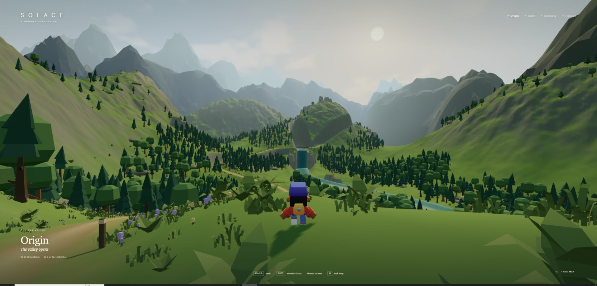

# SOLACE

### A Journey Through Sri

> **What if a portfolio wasn't a webpage — but a world you could walk through?**

<p align="center">
  
</p>

**SOLACE** is a cinematic, interactive 3D personal portfolio where my work, curiosity, story, and ambitions are represented as places inside one continuous explorable world.

Instead of scrolling through sections, you travel through them.

**ORIGIN → CRAFT → CURIOSITY → HORIZON**

---

## 🌄 The World


SOLACE is built as a peaceful mountain valley filled with forests, rivers, trails, distant peaks, landmarks and environmental storytelling.

The goal is not to make a traditional portfolio with a 3D background.

The portfolio **is the world**.

Every region represents a different part of my journey:

### 🌱 ORIGIN
Where I started.

A quiet beginning — open valleys, familiar paths and the first view of the journey ahead.

### 🔨 CRAFT
Things I've built.

A place representing projects, experimentation and the process of turning ideas into something real.

### 🌲 CURIOSITY
Things I'm learning and exploring.

Deeper forests, branching paths and places that reward exploration.


### 🏔️ HORIZON
Where I'm going.

The distant destination visible throughout the journey — representing future ambitions and everything still ahead.

---

## 🎮 This Is Not a Normal Portfolio

SOLACE is designed around exploration rather than navigation menus.

The player can:

- walk through a continuous 3D world
- follow trails across mountains and forests
- discover portfolio content naturally
- see future destinations from earlier parts of the journey
- experience the portfolio as a story rather than a list of projects

The world is intentionally built with strong foreground, midground and background composition so that distant landmarks create a constant sense of direction and curiosity.

---

## ✨ Current State

SOLACE is actively being developed.

The current build already includes:

- a large continuous mountain-valley world
- long-distance traversal
- layered procedural terrain
- forests and vegetation
- rivers and water
- bridges and paths
- distant mountain scenery
- atmospheric lighting and haze
- an animated third-person character
- a custom chase camera
- region-aware presentation
- development traversal validation

The current world route spans roughly **900+ metres of traversal**.

Detailed portfolio interactions, settlements, the railway journey, final waterfall system, environmental storytelling and the full Horizon experience are still being built.

---

## 🧭 Design Philosophy

SOLACE follows one core rule:

> **The portfolio is a world.**

The experience should feel:

- peaceful
- cinematic
- handcrafted
- exploratory
- personal

Not like a tech demo.

Not like four disconnected levels.

And definitely not like a normal portfolio with Three.js placed behind some HTML.

The player should constantly be able to look into the distance and think:

> *I want to go there.*

---

## 🛠️ Built With

- **React**
- **TypeScript**
- **Three.js**
- **React Three Fiber**
- **Vite**

3D assets are primarily built from selected **Kenney** asset kits, combined with custom terrain generation, world composition, environmental systems and procedural placement.

---

## 🤖 Building SOLACE With AI

A major part of this project is also an experiment in a new way of building software.

SOLACE is being developed with **GPT-6 Astra Ultra** through the **Codex CLI**, using ChatGPT Plus.

Rather than treating the model like a code generator and specifying every implementation detail, I describe the creative goal, constraints and intended experience in normal language.

Astra then works directly inside the codebase: inspecting the existing architecture, implementing systems, running builds, validating traversal and iterating on the world.

One of the biggest lessons from building SOLACE has been surprisingly simple:

> **Good AI collaboration isn't necessarily about writing enormous prompts.  
> Sometimes it's about explaining what you actually want clearly and letting the model think.**

The first major world-foundation pass was built from a human-style description of the world I wanted — not a giant implementation specification.

The result became the foundation you see here.

---

## 🗺️ Development Roadmap

### World Foundation ✅
Continuous terrain, traversal, mountains, forests, water, paths, atmosphere and overall world composition.

### World & Region Development 🚧
Origin, Craft, Curiosity, railway journey, waterfall, settlements and Horizon.

### Portfolio Layer
Projects, personal story, learning journey and interactive environmental content.

### Cinematic Pass
Lighting progression, environmental animation, particles, improved water, train movement, ambience and sound.

### Final Production Pass
Performance optimisation, loading experience, accessibility, responsive fallback, deployment polish and browser/device testing.

---

## 🖼️ Screenshots

### Origin


### Curiosity


More environments will be added as the journey grows.

---

## 🚀 Running Locally

Clone the repository:

```bash
git clone https://github.com/SriramBharath-7/SOLACE.git
```

Enter the project:

```bash
cd SOLACE
```

Install dependencies:

```bash
npm install
```

Start the development server:

```bash
npm run dev
```

Create a production build:

```bash
npm run build
```

---

## 🎯 Why I Built This

I've seen plenty of portfolios that show who someone is through cards, sections and timelines.

I wanted to try something different.

I wanted someone visiting my portfolio to **experience the journey**.

To start somewhere small.

To see distant places.

To explore.

To discover what I've built.

And eventually reach the horizon.

That idea became **SOLACE**.

---

## 👨‍💻 Created By

**Sriram Bharath**

Computer Science student • Builder • Cybersecurity enthusiast

GitHub: [@SriramBharath-7](https://github.com/SriramBharath-7)

---

<p align="center">
  <strong>SOLACE — A Journey Through Sri</strong><br>
  <em>The portfolio is a world.</em>
</p>
